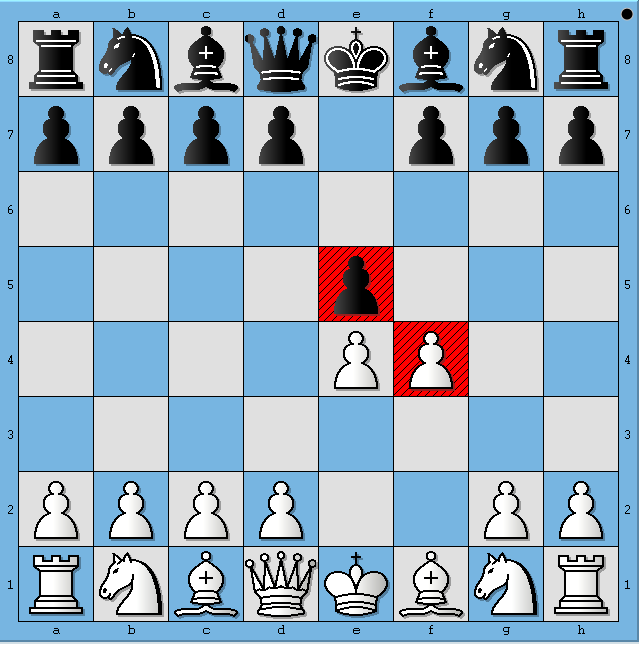
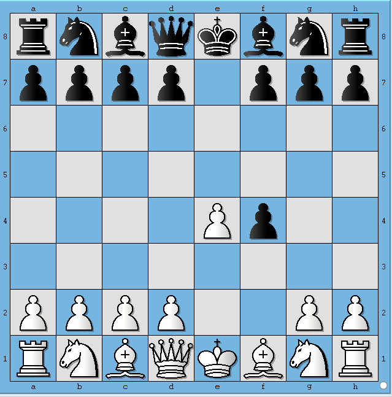
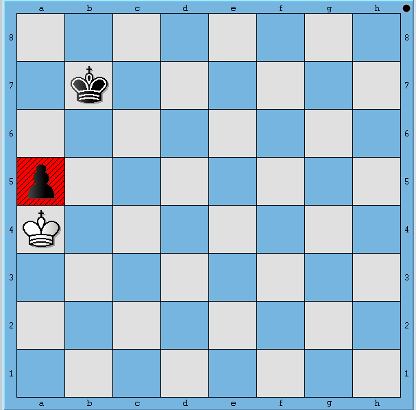
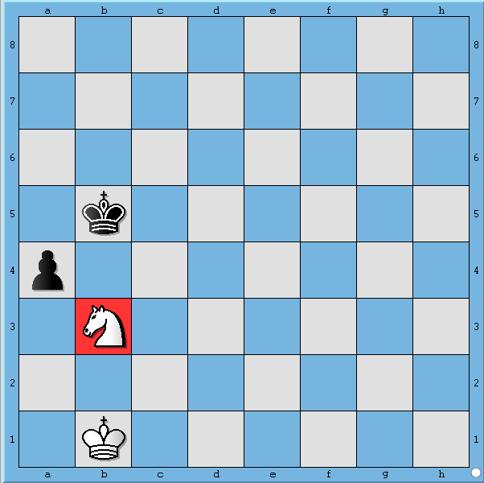

<html>
  <body>
    <table>
      <tbody>
        <tr>
          <td width="auto" valign="top">
            

              
	
                

                  <b style="mso-bidi-font-weight:
                            normal">
                    Problem : Pawn Moves 
                      <o:p>
                      </o:p>
                    
                  </b>
                

                

                   
                  <b>Background
                  </b>
                   
                   
                  A Chess board position is accurately captured by Forsyth-Edwards notation and is abbreviated as FEN. A FEN "record" defines a particular game position, all in one text line and using only the ASCII character set. A FEN record contains six fields. A complete description of the FEN format to represent Chess positions can be found at 
                  <a href="https://en.wikipedia.org/wiki/Forsyth%E2%80%93Edwards_Notation" target="_blank" style="color:#0000ff; background-color:transparent; text-decoration:none">here
                  </a> 
                   
                   
                  For the purpose of this problem only consider first of the six fields of FEN. Before we describe the problem, let us look at how FEN maps to a board position. The following 5 images show board positions and its corresponding FEN representation.
                   
                   
                

                

                  
                   
                  &nbsp;&nbsp;&nbsp;&nbsp;&nbsp;&nbsp;&nbsp;&nbsp;&nbsp;&nbsp;&nbsp;&nbsp;&nbsp;&nbsp;&nbsp;&nbsp;&nbsp;&nbsp;&nbsp;&nbsp;
                  
                  
                    <b>Figure 1.
                    </b>
                  
                

                 
                 
                 
                 
                

                

                <table style="float:right;" border="1" cellspacing="0" cellpadding="2" width="400">
                  <tbody>
                    <tr>
                      <td>This board position depicts initial position before any side has made a move. In FEN format this board position is represented as 
                         
                         
                         
                        rnbqkbnr/pppppppp/8/8/8/8/PPPPPPPP/RNBQKBNR w
                      </td>
                    </tr>
                  </tbody>
                </table>
                 
                 
                 
                 
                 
                 
                

                

                 
                 
                 
                 
                 
                 
                 
                 
                 
                Let's say, White plays e4. Then the board position looks like shown below
                 
                 
                

                  
                   
                  &nbsp;&nbsp;&nbsp;&nbsp;&nbsp;&nbsp;&nbsp;&nbsp;&nbsp;&nbsp;&nbsp;&nbsp;&nbsp;&nbsp;&nbsp;&nbsp;&nbsp;&nbsp;&nbsp;&nbsp;
                  
                  
                    <b>Figure 2.
                    </b>
                  
                

                 
                 
                 
                 
                

                

                <table style="float:right;" border="1" cellspacing="0" cellpadding="2" width="400">
                  <tbody>
                    <tr>
                      <td>This board position depicts the Chess board after White has played e4. In FEN format this board position is represented as 
                         
                         
                         
                        rnbqkbnr/pppppppp/8/8/4P3/8/PPPP1PPP/RNBQKBNR b
                      </td>
                    </tr>
                  </tbody>
                </table>
                 
                 
                 
                

                

                 
                 
                 
                 
                 
                 
                 
                 
                 
                 
                 
                 					
                Similarly, 3 more half-moves are depicted in following diagrams
                 
                 
                

                  &nbsp;
                  &nbsp;
                  
                  &nbsp;&nbsp;&nbsp;&nbsp;&nbsp;&nbsp;&nbsp;&nbsp;&nbsp;&nbsp;&nbsp;&nbsp;&nbsp;&nbsp;&nbsp;&nbsp;&nbsp;&nbsp;&nbsp;&nbsp;
                  
                  
                    <b>Figure 3.
                    </b>
                  
                  &nbsp;&nbsp;&nbsp;&nbsp;&nbsp;&nbsp;&nbsp;&nbsp;&nbsp;&nbsp;&nbsp;&nbsp;&nbsp;&nbsp;&nbsp;&nbsp;&nbsp;&nbsp;&nbsp;&nbsp;
                  
                  &nbsp;&nbsp;&nbsp;&nbsp;&nbsp;&nbsp;&nbsp;&nbsp;&nbsp;&nbsp;&nbsp;&nbsp;&nbsp;&nbsp;&nbsp;&nbsp;&nbsp;&nbsp;&nbsp;&nbsp;
                  
                  &nbsp;&nbsp;&nbsp;&nbsp;&nbsp;&nbsp;
                  
                  
                    <b>Figure 4.
                    </b>
                  
                  &nbsp;&nbsp;&nbsp;&nbsp;&nbsp;&nbsp;&nbsp;&nbsp;&nbsp;&nbsp;&nbsp;&nbsp;&nbsp;&nbsp;&nbsp;&nbsp;&nbsp;&nbsp;&nbsp;&nbsp;
                  
                  &nbsp;&nbsp;&nbsp;&nbsp;&nbsp;&nbsp;&nbsp;&nbsp;&nbsp;&nbsp;&nbsp;&nbsp;&nbsp;&nbsp;&nbsp;&nbsp;&nbsp;&nbsp;&nbsp;&nbsp;
                  
                  &nbsp;&nbsp;&nbsp;&nbsp;&nbsp;&nbsp;&nbsp;&nbsp;&nbsp;&nbsp;
                  
                  
                    <b>Figure 5.
                    </b>
                  
                

                 
                 
                The FENs corresponding to Figure 3, 4 and 5 are represented as 
                 
                 
                &nbsp;&nbsp;&nbsp;&nbsp;&nbsp;&nbsp;&nbsp;&nbsp;&nbsp;&nbsp;
                
                3.	rnbqkbnr/pppp1ppp/8/4P3/4P3/8/PPPP1PPP/RNBQKBNR w
                 
                &nbsp;&nbsp;&nbsp;&nbsp;&nbsp;&nbsp;&nbsp;&nbsp;&nbsp;&nbsp;
                
                4.	rnbqkbnr/pppp1ppp/8/4p3/4PP2/8/PPPP2PP/RNBQKBNR b
                 
                &nbsp;&nbsp;&nbsp;&nbsp;&nbsp;&nbsp;&nbsp;&nbsp;&nbsp;&nbsp;
                
                5.	rnbqkbnr/pppp1ppp/8/8/4Pp2/8/PPPP2PP/RNBQKBNR w
                 
                 
                <b>Wikipedia describes first field of FEN format as follows
                </b>
                 
                 
                Each rank is described, starting with rank 8 and ending with rank 1; within each rank, the contents of each square are described from file "a" through file "h". Following the 
                <a href="https://en.wikipedia.org/wiki/Algebraic_chess_notation" target="_blank" style="color:#0000ff; background-color:transparent; text-decoration:none">Standard Algebraic Notation
                </a> (SAN), each piece is identified by a single letter taken from the standard English names (pawn = "P", knight = "N", bishop = "B", rook = "R", queen = "Q" and king = "K").[1] White pieces are designated using upper-case letters ("PNBRQK") while black pieces use lowercase ("pnbrqk"). Empty squares are noted using digits 1 through 8 (the number of empty squares), and "/" separates ranks.
                 
                 
                The second field denotes whose move it is now. "w" depicts that it is White's turn to play and "b" indicates that it is Black's turn to play
                 
                 
                <b>CodeVita Problem Statement
                </b>
                 
                 
                Given a board position in FEN format, your task is to find out all the move(s) that Pawn(s) of the playing side can make.
                 
                 	
                

                

                

                  <b>Input Format:
                  </b>
                   
                   
                

                <ol>
                  <li>First line contains single FEN record, which corresponds to a particular board position and also indicates whose turn it is.
                  </li>
                </ol>
                 
                

                

                

                  <b>Output Format:
                  </b>
                   
                   
                

                <ol>
                  <li>1The output must be printed as follows
                    <ol>
                      <li>All legal moves that Pawn(s) can make must be in the format "[&lt;Move Format&gt;]"
                      </li>
                      <li>Where &lt;Move Format&gt; is move represented in format "[fromSquare][toSquare]"
                      </li>
                    </ol>
                  </li>
                  <li>See Example section for better understanding of output format
                  </li>
                  <li>Follow Output printing specification to print the output in required format
                  </li>
                </ol>
                 
                

                

                

                  
                    <b>Constraints:
                    </b>
                  
                   
                   
                

                <ol>
                  <li>There is no need to handle 
                    <a href="https://en.wikipedia.org/wiki/En_passant" target="_blank" style="color:#0000ff; background-color:transparent; text-decoration:none">En Passant
                    </a> positions. There are no test cases involving En Passant moves.
                  </li>
                  <li>No need to implement 
                    <a href="https://en.wikipedia.org/wiki/Promotion_(chess)" target="_blank" style="color:#0000ff; background-color:transparent; text-decoration:none">pawn promotion
                    </a> rules. Our test cases do not contain positions which will lead to a pawn getting promoted.
                  </li>
                </ol>
                 
                

                

                <a>
                  <b>Sample Input and Output
                  </b>
                </a>
                <a>
                   
                   
                  <table width="700px" border="1" cellspacing="0" cellpadding="2">
                    <tbody>
                      <tr>
                        <th style="height:20px">SNo.
                        </th>
                        <th style="height:20px">Input
                        </th>
                        <th style="height:20px">Board Depiction
                        </th>
                        <th style="height:20px">Output
                        </th>
                      </tr>
                      <tr>
                        <td style="width:10px;">1
                        </td>
                        <td style="width:230px;">
                           8/1k6/8/p7/K7/8/8/8 b
                           
                           
                        </td>
                        <td style="width:300px;">
                           
                          
                           
                           
                        </td>
                        <td style="width:150px">
                           []
                           
                        </td>							
                      </tr>
                      <tr>
                        <td style="width:10px;">2
                        </td>
                        <td style="width:230px;">
                           8/8/8/1k6/p7/1N6/8/1K6 b
                           
                           
                        </td>
                        <td style="width:300px;">
                           
                          
                           
                           
                        </td>
                        <td style="width:150px">
                           [a4a3, a4b3]
                           
                        </td>							
                      </tr>
                      <tr>
                        <td style="width:10px;">3
                        </td>
                        <td style="width:230px;">
                           8/8/8/1k6/p7/1N1p4/8/1K6 b
                           
                           
                        </td>
                        <td style="width:300px;">
                           
                          
                           
                           
                        </td>
                        <td style="width:150px">
                           [a4a3, a4b3, d3d2]
                           
                        </td>							
                      </tr>				
                    </tbody>
                  </table>
                   
                   
                  

                    <b>Print Specification:
                    </b>
                     
                     
                  

                  <ol>
                    <li>Should start with "[" and end with "]"
                    </li>
                    <li>If more than one move is possible, moves should be separated by a comma followed by whitespace
                    </li>
                    <li>Moves of a single pawn should be printed in 
                      <i>Move Format
                      </i>. Scan the board from 8
                      th
                       rank to 1
                      st
                       rank from a-file to h-file. Whichever square gets hit first, that move should be printed first.
                    </li>
                    <li>If more than one pawn exists for side to move, then start scanning for pawn from 8
                      th
                       rank to 1
                      st
                       rank, left to right i.e. from a-file to h-file. Whichever pawn  appears first, print all moves for that pawn first.
                    </li>
                    <li>Verify your understanding of how printing should happen against examples shown above
                    </li>
                  </ol>
                   
                  

                  

                </a>
              

              <a>
                

                  

                    
                      <i>
                        <b>Note
                        </b>
                      </i>
                    :
                      
                     
                    <i> Please do not use package and namespace in your code.
                      For object oriented languages your code should be written in
                      one class.
                    </i>
                  

                  

                    
                      <i>
                        <b>Note
                        </b>
                      </i>
                    :
                      
                     
                    <i>Participants submitting solutions in C language should
                      not use functions from &lt;conio.h&gt; / &lt;process.h&gt; as
                      these files do not exist in gcc
                    </i>
                  

                  

                    
                      <i>
                        <b>Note
                        </b>
                      </i>
                    :
                      
                     
                    <i>For C and C++, return type of main() function should be
                      int.
                    </i>
                  

                    
                    
                  

                     
                  

                

              </a>
            

            <a> 
                
                
            </a>
           </td>          
        </tr>
      </tbody>
    </table>
  </body>
</html>
