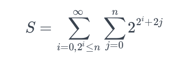

<html>
  <body>
    <table>
      <tbody>
        <tr>
          <td width="auto" valign="top">
            

              

                

                  <b style="mso-bidi-font-weight: normal">
                    Problem : Last Digit
                    
                  </b>
                

                

                   
                  <b>Statement :
                  </b>
                   
                   
                  Compute the last digit of the following sequence
                   
                   
                  
                   
                   
                  i.e. Summation of F(n) from i = 0 to 2^i &amp;tl;= n, where F(n) is the summation of 2^(2^i+2j) Where j varies from 0 to n
                   
                   
                

                

                  <b>Input Format:
                  </b> 
                   
                   
                  Single integer representing n
                   
                   
                

                

                  <b>Output Format:
                  </b> 
                   
                   Last digit of the number S
                   
                   
                

                

                  
                    <b>Constraints:
                    </b>
                  
                   
                

                

                  <b>
                  </b>
                

                <ol>
                  <b>
                    <li>0&lt;=n&lt;=10^17   
                    </li>
                  </b>
                </ol>
                 
                

                

                

                

                <a>
                  <b>Sample Input and Output
                  </b>
                </a>
                <a>
                   
                   
                  <table width="650px" border="1" cellspacing="0" cellpadding="2">
                    <tbody>
                      <tr>
                        <th style="height: 20px">SNo.
                        </th>
                        <th style="height: 20px">Input
                        </th>
                        <th style="height: 20px">Output
                        </th>
                      </tr>
                      <tr>
                        <td style="width: 7px;">
                           1
                        </td>
                        <td style="width: 300px;">
                           3
                           
                        </td>
                        <td style="width: 200px">
                           0
                           
                        </td>
                      </tr>
                      <tr>
                        <td style="width: 7px;">2
                        </td>
                        <td style="width: 300px;">
                           10	
                           
                        </td>
                        <td style="width: 200px">
                           8
                           
                           
                        </td>
                      </tr>
                    </tbody>
                  </table> 
                   
                   
                </a>
              

              <a>
                

                  

                    
                      <i>
                        <b>Note
                        </b>
                      </i>
                    :
                      
                     
                    <i> Please do not use package and namespace in your code.
                      For object oriented languages your code should be written in
                      one class.
                    </i>
                  

                  

                    
                      <i>
                        <b>Note
                        </b>
                      </i>
                    :
                      
                     
                    <i>Participants submitting solutions in C language should
                      not use functions from &lt;conio.h&gt; / &lt;process.h&gt; as
                      these files do not exist in gcc
                    </i>
                  

                  

                    
                      <i>
                        <b>Note
                        </b>
                      </i>
                    :
                      
                     
                    <i>For C and C++, return type of main() function should be
                      int.
                    </i>
                  

                    
                   
                  

                     
                  

                

              </a>
            

		  </td>
        </tr>
      </tbody>
    </table>
  </body>
</html>
