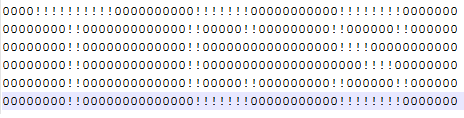
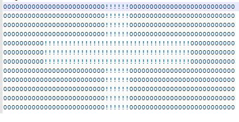

<html>
  <body>
    <table>
      <tbody>
        <tr>
          <td width="auto" valign="top">
            

              

                

                  <b style="mso-bidi-font-weight: normal">
                    Problem : RLE String
                      <o:p>
                      </o:p>
                    
                  </b>
                

                

                  Given a Run Length Encoded ASCII (Base 64) String as input, write a program to decode the string and print the corresponding image. Number of characters in each row of the resulting image is always 57.
                   
                   
                  This question can be understood once we understand how RLE maps to an image. Have a look at the Example section to get this understanding.
                    
                   
                

                

                  <b>Input Format:
                  </b> 
                   
                   RLE ASCII String
                   
                   
                

                

                  <b>Output Format:
                  </b> 
                    
                   
                  Ascii data resembling an image corresponding to input RLE String
                    
                   
                

                

                  <b>Example:
                  </b> 
                    
                   
                  The following string is a RLE string
                    
                   
                  <b>DJJGKHG HBMBEBIBFBF HBMBQDK HBMBTDH HBMBEBIBFBF HBNGKHG
                  </b>
                   
                   
                  It gets converted into the image below. You should see 'TCS' emerge by embossing the '!' character on '0' character
                   
                   
                

                
 
                  
                   
                  <b>Fig. 1. Ascii Image corresponding to RLE string shown above
                  </b>
                

                 
                 
                Note: - Each row comprising only of '!' and '0' has a length of exactly 57 characters
                 Now let's understand the steps to convert the RLE into the image
                <ol>
                  <li>Split the RLE string on space character. For each substring achieved after splitting do step 2
                  </li>
                  <li>
                    <b>Lets perform the required calculation on first row of ascii image
                    </b>:- which is 
                    <b>DJJGKHG
                    </b>
                    <ol>
                      <li>Where, highlighted value is calculated as (Ascii value of(D)-64) (68-64)=
                        4
                        
                      </li>
                      <li>(Ascii value of(J)-64)-&gt;(74-64)=
                        10
                        
                      </li>
                      <li>(Ascii value of(J)-64)-&gt; (74-64)=
                        10
                        
                      </li>
                      <li>(Ascii value of(G)-64)-&gt; (71-64)=
                        7
                        
                      </li>
                      <li>(Ascii value of(K)-64)-&gt; (75-64)=
                        11
                        
                      </li>
                      <li>(Ascii value of(H)-64)-&gt; (72-64)=
                        8
                        
                      </li>
                      <li>(Ascii value of(G)-64)-&gt; (71-64)=
                        7
                        
                      </li>
                    </ol>
                  </li>
                  <li>Addition of all numerical values for each character in every sub-string as computed in step 2 should equal 57
                  </li>
                  <li>Corresponding to each alphabet in the sub-string, say D, a number, 4 in this case, is achieved by operation denoted in step 2
                  </li>
                  <li>Print '0' 4 times (let's call this operation multiply) which will produce a string '0000'
                  </li>
                  <li>Take the next character, J in this case and number 10 achieved by performing operation denoted in step 2
                  </li>
                  <li>Toggle '0' to '!' and print it 10 times which will produce a string '!!!!!!!!!!'
                  </li>
                  <li>Similarly, for each even index in sub-string multiply '0' with corresponding number and for each odd index in sub-string multiply '!' with corresponding number. Sub-string starts with index 0.
                  </li>
                  <li>After processing each sub-string you will get the corresponding row in the ascii image
                  </li>
                  <li>When all sub-strings are processed you will get all rows which will form the ascii image. Print that as output.
                  </li>
                </ol>
                

                

                

                

                <a>
                  <b>Sample Input and Output
                  </b>
                </a>
                <a>
                    
                   
                  <b>Input1:
                  </b>		
                   
                  DJJGKHG HBMBEBIBFBF HBMBQDK HBMBTDH HBMBEBIBFBF HBNGKHG
                   
                   
                  <b>Output1:
                  </b>
                   
                   
                  
                    
                   
                  <b>Input2:
                  </b>		
                   
                  YFZ YFZ YFZ YFZ JdK JdK JdK YFZ YFZ YFZ YFZ YFZ
                   
                   
                  <b>Output1:
                  </b>
                   
                   
                  
                    
                   
                </a>
              

              <a>
                

                  

                    
                      <i>
                        <b>Note
                        </b>
                      </i>
                    :
                      
                     
                    <i> Please do not use package and namespace in your code.
                      For object oriented languages your code should be written in
                      one class.
                    </i>
                  

                  

                    
                      <i>
                        <b>Note
                        </b>
                      </i>
                    :
                      
                     
                    <i>Participants submitting solutions in C language should
                      not use functions from &lt;conio.h&gt; / &lt;process.h&gt; as
                      these files do not exist in gcc
                    </i>
                  

                  

                    
                      <i>
                        <b>Note
                        </b>
                      </i>
                    :
                      
                     
                    <i>For C and C++, return type of main() function should be
                      int.
                    </i>
                  

                    
                   
                  

                     
                  

                

              </a>
            
</td>
        </tr>
      </tbody>
    </table>
  </body>
</html>
