<html>
  <body>
    <table>
      <tbody>
        <tr>
          <td width="auto" valign="top">
            

              

                

                  <b style="mso-bidi-font-weight: normal">
                    Problem : Long Division Method
                    
                  </b>
                

                

                  <b>Statement :
                  </b>
                   
                   
                  Math is here back again. With a number of methods out there, let's implement this famous 
                  <b>Long Division
                  </b> method to find the square root of a number, via code.
                   
                   
                  For example, let's calculate the square root of 283.456.
                   
                   
                  Steps to calculate square root of 283.456 by Long Division method as follows:
                   
                   
                

                

                  <b>Step 1
                  </b>: Make pairs of the number 283.456 starting from the decimal point(.) and traversing in both left and right directions.
                   
                   
                  

                    

                      on traversing right:
                       
                      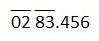
                       
                    

                    

                      on traversing left:
                       
                      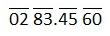
                    

                  
								
                

                 
                 
                

                  <b>Step 2
                  </b>: Begin by taking the closest perfect square.
                   
                   This is how the division would look like
                   
                   
                  

                    
							
                       
                      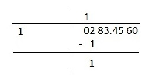
                       
                    

                    
							
                       
                      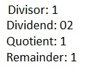
                    

                  
								
                

                 
                 
                

                  <b>Step 3
                  </b>: Whatever new number is taken on the top (in this case: 1), is added on the left-side and the next pair(83) is brought own.
                   
                   This is how the division would look like
                   
                   
                  

                    
							
                       
                      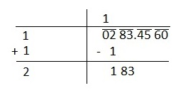
                       
                    

                    
							
                       
                      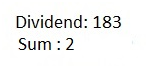
                    

                  
								
                

                 
                 
                

                  <b>Step 4
                  </b>: Now we need to get the closest to the new dividend (in this case: 183)
                   
                   
                  

                    
							
                       
                      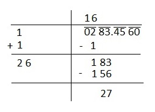
                       
                    

                    
							
                       
                      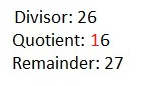
                    
								
                  
	
                   
                   
                  <i>Repeat Steps 3 and 4 until the remainder is 0, or if u reach the decimal point
                  </i>
                

                 
                 
                

                  <b>Step 5
                  </b>: This is how the division would look like
                   
                   
                  

                    
							
                       
                      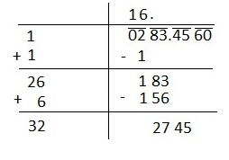
                       
                    

                    
							
                       
                      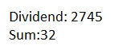
                    
								
                  
	
                   
                   
                  <i>Like normal division, a decimal point is added to the quotient, when traversing/encountering with a decimal point in the dividend
                  </i>
                

                 
                 
                

                  <b>Step 6
                  </b>: This is how the division would look like
                   
                   
                  

                    
							
                       
                      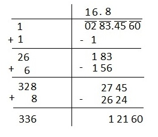
                       
                    

                    
							
                       
                      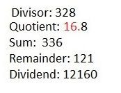
                    
								
                  
	
                   
                   								
                

                 
                 
                

                  <b>Step 7
                  </b>: This is how the division would look like
                   
                   
                  

                    
							
                       
                      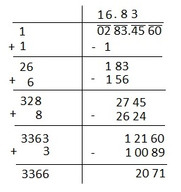
                       
                    

                    
							
                       
                      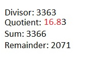
                    
								
                  
	
                   
                   								
                

                 
                 
                

                  <b>Step 8
                  </b>: This is how the division would look like
                   
                   
                  

                    
							
                       
                      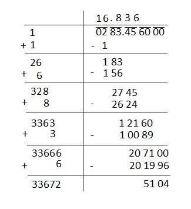
                       
                    

                    
							
                       
                      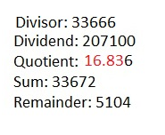
                    
								
                  
	
                   
                   
                  <i>When making the pairs in Step1, ensure that you have 3-pairs or 6-digits after the decimal point 
                  </i>
                   For e.g. if the square root of 3 is to be found; pairs will be made as 3.00 00 00
                

                 
                 
                

                  <b>
                    Note:
                    
                  </b>
                   
                  <ul>
                    <li>In input value after decimal point there should be 3 pairs(6 digits)
                    </li>
                    <li>Output should be printed up to 3 decimal places
                    </li>
                  </ul>
                

                

                

                

                  <b>Input Format:
                  </b> 
                   
                   
                  Number whose square root is to be found
                   
                   
                

                

                  <b>Output Format:
                  </b> 
                   
                   For every input, the output would be a line containing the final set of 5 numbers, delimited by space. The numbers are
                

                <ol>
                  <li>Dividend in the step where actual square root up to desired precision is obtained
                  </li>
                  <li>Divisor in the step where actual square root up to desired precision is obtained
                  </li>
                  <li>Quotient in the last step 
                  </li>
                  <li>Remainder in the step where actual square root up to desired precision is obtained 
                  </li>
                  <li>Sum in the step where actual square root up to desired precision is obtained 
                  </li>
                </ol>
                 
                See examples for better understanding
                 
                 
                

                

                <a>
                  <b>Sample Input and Output
                  </b>
                </a>
                <a>
                   
                   
                  <table width="650px" border="1" cellspacing="0" cellpadding="2">
                    <tbody>
                      <tr>
                        <th style="height: 20px">SNo.
                        </th>
                        <th style="height: 20px">Input
                        </th>
                        <th style="height: 20px">Output
                        </th>
                      </tr>
                      <tr>
                        <td style="width: 7px;">
                           1
                           
                        </td>
                        <td style="width: 100px;">
                           45.478
                           
                        </td>
                        <td style="width: 300px">
                           50400 13483 
                          <mark>6.743
                          </mark> 9951 13486
                           
                        </td>
                      </tr>
                      <tr>
                        <td style="width: 7px;">
                           2
                           
                        </td>
                        <td style="width: 100px;">
                           16
                           
                        </td>
                        <td style="width: 300px">
                           16 04 
                          <mark>4.000
                          </mark> 0 8
                           
                        </td>
                      </tr>
                      <tr>
                        <td style="width: 7px;">
                           3
                           
                        </td>
                        <td style="width: 100px;">
                           283.456
                           
                        </td>
                        <td style="width: 300px">
                           207100 33666 
                          <mark>16.836
                          </mark> 5104 33672
                           
                        </td>
                      </tr>
                    </tbody>
                  </table> 
                   
                   
                </a>
              

              <a>
                

                  

                    
                      <i>
                        <b>Note
                        </b>
                      </i>
                    :
                      
                     
                    <i> Please do not use package and namespace in your code.
                      For object oriented languages your code should be written in
                      one class.
                    </i>
                  

                  

                    
                      <i>
                        <b>Note
                        </b>
                      </i>
                    :
                      
                     
                    <i>Participants submitting solutions in C language should
                      not use functions from &lt;conio.h&gt; / &lt;process.h&gt; as
                      these files do not exist in gcc
                    </i>
                  

                  

                    
                      <i>
                        <b>Note
                        </b>
                      </i>
                    :
                      
                     
                    <i>For C and C++, return type of main() function should be
                      int.
                    </i>
                  

                    
                   
                  

                     
                  

                

              </a>
            
</td>
        </tr>
      </tbody>
    </table>
  </body>
</html>
